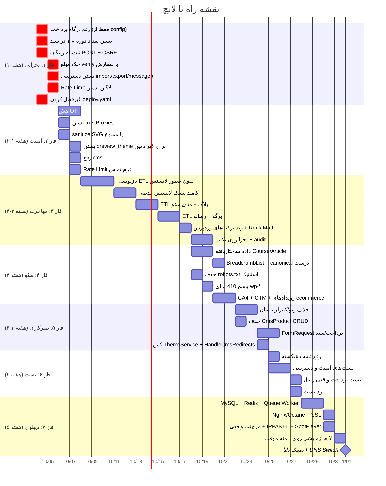

# 🔍 گزارش بررسی پروژه — راهبر حساب
### نقش: مدیر پروژه | تاریخ: ۱۲ مهر ۱۴۰۵ (۳ اکتبر ۲۰۲۶)

---

## 📊 خلاصه وضعیت کلی

| شاخص | وضعیت |
|------|-------|
| **فریمورک** | Laravel 12 + Blade + Alpine.js + Vite + Tailwind 4 |
| **تم ادمین** | Vuexy (Commercial) |
| **تعداد مدل** | 34 مدل Eloquent |
| **تعداد کنترلر** | ~30 کنترلر (Admin/Site/Panel/Auth/API) |
| **تعداد سرویس** | 22 سرویس |
| **تعداد تست** | ~28 تست (۱ شکسته) |
| **مایگریشن** | 17 فایل |
| **وضعیت MVP** | منتشر شده (۲۱ سپتامبر ۲۰۲۶) |
| **آمادگی لانچ** | ❌ آماده نیست — مشکلات بحرانی وجود دارد |

---

## 🚨 مشکلات بحرانی (بلاکر لانچ)

> [!CAUTION]
> این موارد **حتماً قبل از لانچ** باید برطرف شوند. بدون رفع هر کدام، ریسک از دست رفتن پول، کاربر و رتبه سئو وجود دارد.

### ۱. ⛔ درگاه پرداخت از ورودی کاربر می‌آید
- **فایل:** [ShopController.php](file:///c:/laragon/www/rahbarhesabsite/app/Http/Controllers/Site/ShopController.php#L139)
- **مشکل:** خط `$gateway = $request->input('gateway', ...)` — کلاینت می‌تواند `zarinpal` بفرستد در حالی که سرور فقط `zibal` تنظیم دارد. زرین‌پال پیش‌فرض sandbox دارد و مرچنت الکی.
- **ریسک:** پرداخت موفق قلابی
- **مبلغ برگشتی درگاه با `orders.total` مقایسه نمی‌شود** — کاربر ممکن است مبلغ کمتری پرداخت کند

### ۲. ⛔ سبد خرید، دوره را مثل کالای شمارشی می‌فروشد
- **فایل:** [CartService.php](file:///c:/laragon/www/rahbarhesabsite/app/Services/CartService.php#L42)
- **مشکل:** هر بار `add` می‌شود، `quantity` افزایش می‌یابد. دانشجو می‌تواند یک دوره را ۳ بار بگذارد و ۳ برابر بپردازد
- **ریسک:** خسارت مالی به کاربر + شکایت
- هر بار تسویه هم یک سفارش `pending` جدید می‌سازد بدون لغو pending قبلی

### ۳. ⛔ ثبت‌نام رایگان با GET
- **مسیر:** `GET /courses/{slug}/enroll-free`
- **مشکل:** با باز کردن یک لینک (حتی پیش‌بارگذاری مرورگر یا تصویر) کاربر لاگین‌شده ثبت‌نام می‌شود
- **ریسک:** CSRF و ثبت‌نام ناخواسته
- باید `POST` با `@csrf` باشد

### ۴. ⛔ دسترسی ادمین سوراخ است
- **فایل:** [EnsureAdminPermission.php](file:///c:/laragon/www/rahbarhesabsite/app/Http/Middleware/EnsureAdminPermission.php#L30-L49)
- **مشکل:** اگر نام route در `Permission::routeMap()` نباشد → دسترسی باز!
- **روت‌های بدون محافظت:**
  - `admin.import` / `admin.export` — ورود/خروج صفحات و تنظیمات
  - `admin.messages.*` — خواندن پیام‌های تماس
  - `admin.dashboard` و `admin.search`
- **ریسک:** ادمین با نقش محدود (مثل مدرس) به import/export و پیام‌ها دسترسی دارد

### ۵. ⛔ لاگین ادمین بدون محدودیت تلاش
- `/admin/login` محدودیت Rate Limit ندارد
- **ریسک:** حمله Brute Force

### ۶. ⛔ مهاجرت وردپرس، لایسنس جدید صادر می‌کند
- **فایل:** [WordpressMigrationService.php](file:///c:/laragon/www/rahbarhesabsite/app/Services/WordpressMigrationService.php)
- **مشکل:** `migrateOrders` بعد از ساخت سفارش، `enrollUser` را صدا می‌زند که `IssueSpotplayerLicenseJob` ایجاد می‌کند
- **ریسک:** روی ~۸,۵۰۰ سفارش، هزاران لایسنس **جدید** ساخته می‌شود. سهمیه API می‌سوزد و دسترسی دانشجوهای قدیمی عوض می‌شود

### ۷. ⛔ دیپلوی فعلی به پروژه CRM اشاره می‌کند
- **فایل:** [deploy.yaml](file:///c:/laragon/www/rahbarhesabsite/.github/workflows/deploy.yaml)
- `chabok deploy -s crm` — اگر workflow فعال باشد، کد این پروژه را به سرویس CRM می‌فرستد!
- اکشن‌های قدیمی (`checkout@v2`, `setup-node@v1`)

### ۸. ⛔ فایل robots.txt استاتیک لوکال
- **فایل:** [robots.txt](file:///c:/laragon/www/rahbarhesabsite/public/robots.txt)
- آدرس `http://127.0.0.1:8000` — روی پروداکشن گوگل این URL را crawl نمی‌کند
- هر دو robots (استاتیک `public/robots.txt` و لاراول `Route`) فعال‌اند و با هم تداخل دارند

---

## ⚠️ مشکلات امنیتی

> [!WARNING]
> مشکلات امنیتی که ریسک نفوذ یا نشت اطلاعات دارند.

| # | مشکل | فایل/محل | شدت |
|---|------|----------|-----|
| 1 | کد OTP متن ساده در دیتابیس ذخیره می‌شود | `otp_verifications` | بالا |
| 2 | `trustProxies(at: '*')` — هر کلاینتی پروکسی حساب می‌شود | `bootstrap/app.php` | بالا |
| 3 | آپلود SVG بدون sanitize روی دیسک `public` | `AdminMediaController` | بالا (XSS) |
| 4 | `{!! !!}` روی بدنه بلاگ، درس، بلوک `html`/`text`/`columns` | قالب Blade | متوسط (XSS) |
| 5 | `CMS_ADMIN_PASSWORD=secret` در `.env.example` | `.env.example` | متوسط |
| 6 | `docs/CMS-PLATFORM.md` حساب `admin@bisan.ir / password` | مستندات | پایین |
| 7 | `?preview_theme=` بدون لاگین قالب را عوض می‌کند | ThemeService | متوسط |
| 8 | API v1 با یک Bearer ثابت `CMS_API_TOKEN` | `EnsureApiToken` | متوسط |
| 9 | `POST /contact` بدون Rate Limit و ضداسپم | `ContactController` | متوسط |
| 10 | `cms:ensure-admin` همه ادمین‌های دیگر را حذف می‌کند | Console Command | بالا |

---

## 🏗️ ویژگی‌های ناقص (باید تکمیل شوند)

### مهاجرت وردپرس (ETL)
| آیتم | وضعیت | یادداشت |
|------|-------|---------|
| انتقال کاربران | ✅ کد آماده | اجرا روی بکاپ نشده |
| انتقال دوره‌ها | ✅ کد آماده | اجرا روی بکاپ نشده |
| انتقال سفارشات | ✅ کد آماده | ⚠️ لایسنس جدید صادر می‌کند! |
| audit تعداد | ✅ کد آماده | تطبیق با لایو نشده |
| انتقال بلاگ و متای سئو | ❌ ندارد | — |
| انتقال برگه‌ها | ❌ ندارد | — |
| انتقال رسانه و تصاویر | ❌ ندارد | URL‌های قدیمی بی‌پاسخ می‌مانند |
| سرفصل و درس دوره | ❌ ندارد | — |
| ریدایرکت‌های Rank Math | ❌ ندارد | فقط ورود دستی امکان‌پذیر |
| کوپن‌های ووکامرس | ❌ ندارد | — |
| لایسنس‌های قدیمی اسپات | ❌ ندارد | کامند سینک ندارد |
| محتوای المنتور | ❌ ندارد | `post_content` خالی خواهد بود |

### احراز هویت و OTP
| آیتم | وضعیت |
|------|-------|
| OTP با SMS | ✅ |
| ورود با رمز وردپرس + ارتقا به Bcrypt | ✅ |
| Throttle کش | ✅ (اما Cache دیتابیسی) |
| انتقال OTP به Redis | ❌ باقی‌مانده |
| هش کردن کد OTP | ❌ متن ساده |

### فرانت‌اند و قالب
| آیتم | وضعیت |
|------|-------|
| صفحه اصلی راهبر حساب | ✅ قالب اختصاصی |
| صفحه تک‌دوره | ✅ |
| لیست دوره‌ها | ✅ |
| سبد و تسویه | ✅ |
| پنل هنرجو | ✅ |
| بلاگ | ✅ |
| تمیزکاری CSS/JS المنتور | ❌ |
| بازطراحی لندینگ‌ها | ❌ |
| بهینه‌سازی فونت (WOFF2) | ❌ |
| **ویوهای بیسان هنوز زنده** | ⚠️ fallback خاموش برند قبلی را نشان می‌دهد |
| `CmsProduct` و `ProductController` بیسان هنوز زنده | ⚠️ |

### سئو
| آیتم | وضعیت | یادداشت |
|------|-------|---------|
| سایت‌مپ | ✅ | `lastmod` باید چک شود |
| robots.txt لاراول | ✅ | اما فایل استاتیک تداخل دارد |
| متای سئو (title/description/canonical) | ✅ بخشی | متای وردپرس منتقل نشده |
| داده ساختاریافته `Course` | ❌ | |
| داده ساختاریافته `Article` | ❌ | |
| `BreadcrumbList` JSON-LD | ❌ | |
| ریدایرکت URLهای ایندکس‌شده وردپرس | ❌ بخشی | فقط `/product/{slug}` |
| پاسخ 410 برای `/wp-login.php`, `/wp-admin` | ❌ | |
| Google Analytics 4 / GTM | ❌ | |
| رویدادهای Ecommerce (add_to_cart, purchase) | ❌ | |
| canonical صحیح روی پروداکشن | ❌ | |
| noindex برای `/search`, `/cart`, `/checkout`, `/panel` | ❌ باید چک شود | |
| بازنویسی لینک‌های داخلی محتوا | ❌ | |

### پرداخت و خرید
| آیتم | وضعیت |
|------|-------|
| زیبال (تست) | ✅ |
| زرین‌پال | ✅ کد آماده (sandbox) |
| قفل کال‌بک | ✅ |
| کوپن | ✅ |
| پرداخت مجدد | ✅ |
| **چک مبلغ verify** | ❌ |
| **درگاه فقط از config** | ❌ (از request می‌آید) |
| **تعداد دوره = ۱** | ❌ |
| **لغو pending قبلی** | ❌ |
| مرچنت واقعی زیبال | ❌ (sandbox) |
| FormRequest پرداخت | ❌ |

### تست و QA
| آیتم | وضعیت |
|------|-------|
| تست خرید موفق | ✅ |
| تست کال‌بک دوبل | ✅ |
| تست کوپن | ✅ |
| **تست شکسته:** `test_free_course_enrollment` | ❌ |
| تست دور زدن درگاه | ❌ |
| تست تعداد > ۱ برای دوره | ❌ |
| تست Race Condition کوپن | ❌ |
| تست نقش ادمین و import | ❌ |
| تست انقضای ثبت‌نام | ❌ |
| تست دانلود درس بدون ثبت‌نام | ❌ |
| لود تست (K6/AB) | ❌ |
| پنتست امنیت | ❌ |
| تست مهاجرت وردپرس | ❌ |

### زیرساخت و DevOps
| آیتم | وضعیت |
|------|-------|
| MySQL پروداکشن | ❌ (پیش‌فرض SQLite) |
| Redis | ❌ |
| Queue Worker | ❌ (بدون آن لایسنس صادر نمی‌شود) |
| Scheduler (cron) | ❌ |
| Horizon | ❌ |
| Nginx / Octane | ❌ |
| SSL | ❌ |
| بکاپ دیتابیس | ❌ |
| لاگ خطا (Sentry/Flare) | ❌ |
| `APP_ENV=production` / `APP_DEBUG=false` | ❌ |
| IPPANEL_API_KEY | ❌ (خالی) |
| SPOTPLAYER_API_KEY | ❌ (خالی) |

---

## 📝 بدهی فنی (Tech Debt)

| بخش | توضیح |
|------|-------|
| سه نسل کد روی هم | Vuexy + بیسان + راهبر حساب — fallback بی‌صدا به برند قبلی |
| دو مدل محصول | `ShopProduct` (فعال) و `CmsProduct` (بیسان) با CRUD ادمین |
| `User.role` و `CmsAdmin` | دو سیستم موازی دسترسی |
| FormRequest تقریباً استفاده نشده | اعتبارسنجی داخل کنترلر |
| `app/Http/Requests/Api/V1/Auth` | از پروژه قبلی مانده، به هیچ route وصل نیست |
| `HandleCmsRedirects` | هر درخواست `Schema::hasTable` می‌زند |
| `ThemeService::active` | هر درخواست کوئری قالب فعال |
| `docs/REMINDERS.md` | مستند CRM است نه این پروژه |
| 13 مایگریشن «تراز» | بعد از تثبیت اسکیما باید یکدست شوند |

---

## 📋 اولویت‌بندی کارها تا لانچ

---

## 📊 خلاصه آماری

| دسته | تعداد آیتم باقی‌مانده |
|------|----------------------|
| 🚨 بلاکر بحرانی | **8** |
| ⚠️ مشکل امنیتی | **10** |
| 🔧 ویژگی ناقص ETL | **7** |
| 🎨 فرانت/قالب | **4** |
| 🔍 سئو | **10+** |
| 🧪 تست | **10+** |
| 🖥️ زیرساخت | **10+** |
| 📝 بدهی فنی | **9** |

---

## 💡 توصیه نهایی

> [!IMPORTANT]
> **برآورد زمان تا لانچ: حداقل ۵ هفته کاری (۲۵ روز)**
>
> اما اگر فقط بلاکرهای بحرانی (فاز ۱ و ۲) بسته شوند و مهاجرت وردپرس با محدودیت‌هایی انجام شود، **لانچ MVP حدود ۳ هفته** ممکن است.

### ترتیب پیشنهادی:
1. **فوری (هفته اول):** ۸ بلاکر بحرانی + مشکلات امنیتی — **بدون این‌ها لانچ ممنوع**
2. **هفته ۲-۳:** بازنویسی ETL + مهاجرت واقعی روی بکاپ + سئو
3. **هفته ۳-۴:** تمیزکاری + تست + فرانت
4. **هفته ۵:** دیپلوی پروداکشن + لانچ آزمایشی + سوئیچ DNS

> [!TIP]
> کارهای فاز ۱ و ۲ را **همزمان روی یک برنچ قاطی نکنید**. فروش را با تست ببندید، بعد مهاجرت را جداگانه ثابت کنید.
